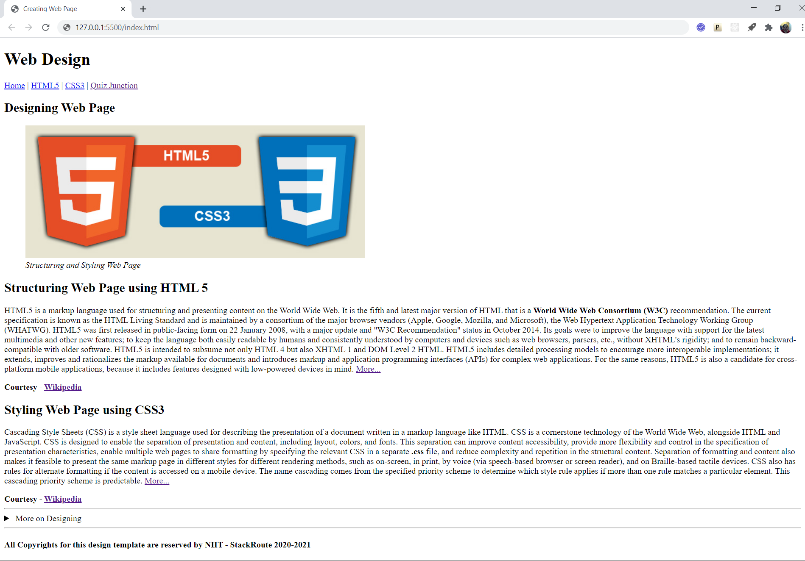

# Assignment
***Build and Deploy an HTML 5 Application -> Creating a Web document using HTML 5 semantic tags***

## Objective
**To design web page providing basic information about HTML5**

### Expected Outcome

Follow the template shown below for designing the web page

### Design Requirements

- The page should be designed based on Web 2.0 standards using semantic HTML5 elements
- Page should have a meaningful title
- Based upon the template shared, you need to identify the various sections of the page, understand the purpose of each of these sections and accordingly use the HTML5 semantic elements
- For example,
    - Main Page heading should use the semantic element - h1
    - The navigation links (non-functional) should be all part of semantic element - nav
    - Both, the main heading and navigation block define the page header and hence should be contained within the semantic element - header
    - All the non-repeating or unique contents of the page should be put inside the semantic element - main 
    
        **Note : The header, footer, navigation bar are all repeating contents as they exist for every webpage of the website**
    - The central idea of the page should be marked using the semantic element - article
    - The contents within the article can be segregated into sections and each section can be marked using the semantic element - section
    - The section headings should be marked using the semantic heading element - h2
    - The image used for illustration can be marked using figure semantic element and captioned using figcaption element
    - For any additional reading to be provided, use the semantic element - aside.
    - Also, to provide clean reading, you may only want to display the heading to the additional reading and provide the details on the click of the heading. This requirement can be handled using the pair of semantic elements - details and summary
    - The copyright information of the page should be contained within the semantic element - footer

### Design Guidelines

- Images provided in boilerplate should only be used
- The navigation links are not expected to be functional and hence do not link them to any page
- Adhere to the files and folder structure provided with the boilerplate

### Code Quality Guidelines

- Usage of **HTML5 semantic elements** is intended in designing the document structure
- Page design Should Not contain any style code
- No 3rd Party frameworks should be used for designing purpose
- Code should be well structured with proper spacing and indentation
- Naming conventions should be followed
- Use Web 2.0 fonts only
- No deprecated code should be used

### Instructions to Build Solution

- Download the starter code available in zipped format from the location --> [Getting Started with HTML]()
- Unzip the .zip file and extract the starter code files
- Launch Visual Studio Code and open the contents of starter code
- Start developing the solution code for the practice
- Keep saving the work frequently
- Test the output through Live Server only

### Project Structure

    📦02_Practice
    ┣📂images
    ┃ ┣📜page-template.png
    ┃ ┗📜section-image.jpg
    ┣📜index.html
    ┗📜Problem.md
    
---
### ALL THE BEST 
---